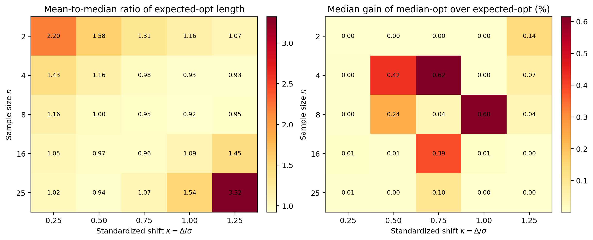

# Median-Length Exact-Coverage Confidence Intervals for the Power of the One-Sample t-Test

This repository is a reproducible research companion for a statistical note on exact-coverage confidence intervals for the power of the one-sample Student t-test.

The central question is:

**What changes when interval width is optimized by the median rather than the mean?**

The answer is comparative rather than dramatic. A median-length criterion is coherent and exact-coverage, and it can matter when realized interval widths are skewed. On the study grid used here, however, the classical expected-length construction is already close to the median benchmark.



## Summary

- The repository formalizes a median-length analogue of the exact-coverage expected-length interval of Chakraborti, Michaelson, and McCracken.
- The implemented comparison covers four procedures: `Equal-tail`, `Expected-opt`, `Median-opt`, and `Median-MC`.
- Exact coverage is preserved because the chi-squared endpoint allocation is fixed before observing the sample standard deviation.
- The largest additional median-length gain over the expected-length rule on the design grid is `0.62%`.
- Mean and median realized widths can differ materially even when the two optimized procedures are numerically close.

## Scope

- The inferential target is the one-sample upper-tailed test: `H0: mu = mu0` versus `H1: mu > mu0`.
- The reported power interval is for a pre-specified raw shift `Delta = mu - mu0`, written in observable form using the observed sample standard deviation `S`.
- The exact-coverage statement is pointwise in a prespecified standardized shift `kappa = Delta / sigma`.
- Following Chakraborti et al., `kappa` is used as a scale-free design index for tabulation, not as a post-data observed effect size.
- The endpoint allocation is fixed before observing `S`; post-hoc allocation rules are invalid for exact coverage.
- The Monte Carlo component is included as a numerical sensitivity analysis and implementation check, not as a separate inferential construction.
- Boundary diagnostics classify allocations relative to `gamma`: lower if `p <= 0.01 * gamma`, upper if `p >= 0.99 * gamma`, otherwise interior.
- For flat numerical median objectives, the implementation uses a deterministic tie-break: choose the smallest near-minimizing allocation on a fixed grid.

## Repository Contents

- [paper/paper.pdf](paper/paper.pdf): compiled manuscript
- [paper/paper.tex](paper/paper.tex): manuscript source
- [paper/paper.bib](paper/paper.bib): bibliography database
- [docs/overview.md](docs/overview.md): concise project overview
- [scripts/median_power_ci.py](scripts/median_power_ci.py): end-to-end numerical pipeline
- [scripts/posthoc_allocation_failure_demo.py](scripts/posthoc_allocation_failure_demo.py): cautionary post-hoc allocation failure demonstration
- [results/](results): generated tables and machine-readable summaries
- [figures/](figures): generated figures used by the manuscript and README
- [docs/revision_addendum.md](docs/revision_addendum.md): manuscript-facing correction memo for revision/public release

## Reproducibility

### Environment

The analysis was generated with:

- Python `3.10`
- `numpy==1.22.3`
- `scipy==1.8.0`
- `pandas==1.4.2`
- `matplotlib==3.5.1`

Install dependencies with:

```powershell
py -3.10 -m pip install -r requirements.txt
```

The manuscript build also requires `pdflatex` and `bibtex` on `PATH`.

### Full Rebuild

```powershell
powershell -ExecutionPolicy Bypass -File .\build.ps1
```

This command regenerates the numerical outputs under `results/` (including [results/posthoc_allocation_demo.csv](results/posthoc_allocation_demo.csv)), regenerates the figures under `figures/`, and rebuilds [paper/paper.pdf](paper/paper.pdf).

## Generated Outputs

- [results/performance_grid.csv](results/performance_grid.csv): full design-grid performance metrics
- [results/summary_grid.csv](results/summary_grid.csv): compact design-grid comparison summary
- [results/monte_carlo_validation.csv](results/monte_carlo_validation.csv): Monte Carlo coverage validation
- [results/mc_sensitivity.csv](results/mc_sensitivity.csv): sensitivity study for the Monte Carlo median approximation
- [results/posthoc_allocation_demo.csv](results/posthoc_allocation_demo.csv): empirical cautionary check for invalid post-hoc allocation
- [figures/length_distribution.pdf](figures/length_distribution.pdf): representative interval-length distributions
- [figures/heatmaps.pdf](figures/heatmaps.pdf): grid-level summaries

## Data Provenance

The repository does not depend on an external observational dataset. All reported outputs are generated from:

- analytical evaluation of the chi-squared pivot and noncentral t power function
- deterministic numerical optimization over the admissible tail allocation
- Monte Carlo draws from the chi-squared distribution for validation and sensitivity analysis

## Citation And Licensing

Citation metadata is provided in [CITATION.cff](CITATION.cff).

The repository uses a split-license structure:

- code in `scripts/` and build helpers is released under the MIT License in [LICENSE](LICENSE)
- manuscript text, documentation, tables, and figures are released under the Creative Commons Attribution 4.0 license in [LICENSE-CONTENT.md](LICENSE-CONTENT.md)

## Reading Order

1. [docs/overview.md](docs/overview.md)
2. [paper/paper.pdf](paper/paper.pdf)
3. [scripts/median_power_ci.py](scripts/median_power_ci.py)
4. [results/summary_grid.csv](results/summary_grid.csv)
